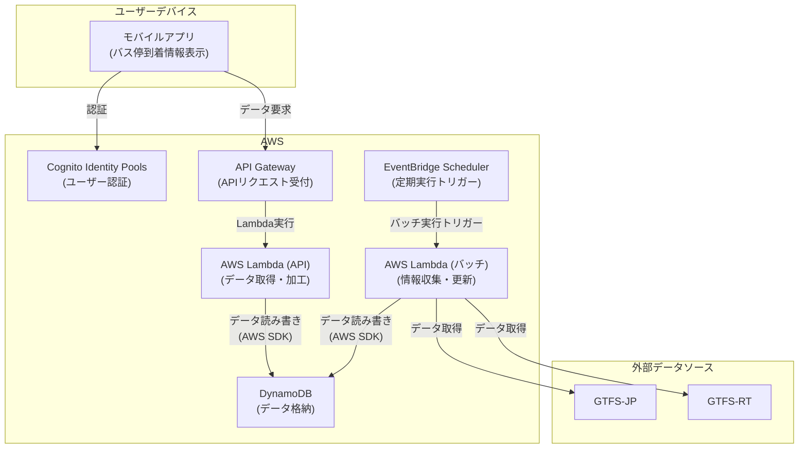

# システム構成図

## コンポーネント概要

- **モバイルアプリ**: ユーザーがバス停到着情報を閲覧するためのインターフェース。
- **Cognito Identity Pools**: ユーザー認証を行い、安全なアクセスを実現。
- **API Gateway**: モバイルアプリからのリクエストを受け付け、適切なLambda関数へ転送。
- **AWS Lambda (API)**: ユーザーリクエストに基づき、DynamoDBからデータを取得・加工して応答。
- **AWS Lambda (バッチ)**: 定期的に外部のGTFS-JPおよびGTFS-RTから情報を取得し、DynamoDBを更新。
- **DynamoDB**: バスの到着情報やユーザー設定などのデータを格納するデータベース。
- **EventBridge Scheduler**: バッチ処理用のLambda関数をスケジュール通りに起動。
- **GTFS-JP**: バスの静的な情報（経路、時刻表、料金など）を提供するデータ形式。
- **GTFS-RT**: バスのリアルタイムな情報（遅延、位置情報など）を提供するデータ形式。 