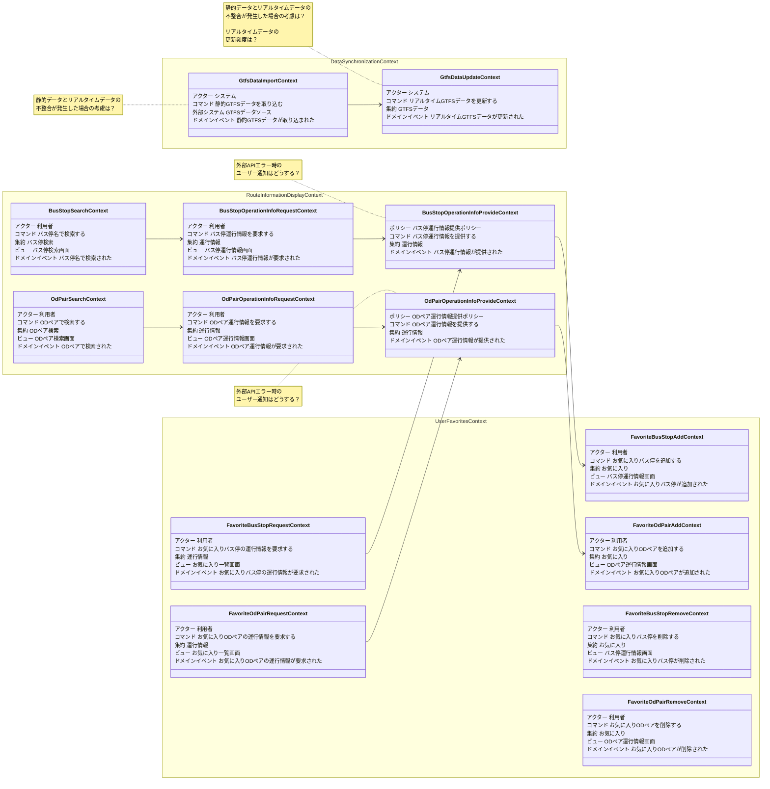

```mermaid
classDiagram
direction LR

  namespace DataSynchronizationContext {
    class GtfsDataImportContext {
      アクター システム
      コマンド 静的GTFSデータを取り込む
      外部システム GTFSデータソース
      ドメインイベント 静的GTFSデータが取り込まれた
    }

    class GtfsDataUpdateContext {
      アクター システム
      コマンド リアルタイムGTFSデータを更新する
      集約 GTFSデータ
      ドメインイベント リアルタイムGTFSデータが更新された
    }
    
  }
  GtfsDataImportContext --> GtfsDataUpdateContext

  namespace RouteInformationDisplayContext {
    class BusStopSearchContext {
      アクター 利用者
      コマンド バス停名で検索する
      集約 バス停検索
      ビュー バス停検索画面
      ドメインイベント バス停名で検索された
    }

    class OdPairSearchContext {
      アクター 利用者
      コマンド ODペアで検索する
      集約 ODペア検索
      ビュー ODペア検索画面
      ドメインイベント ODペアで検索された
    }

    class BusStopOperationInfoRequestContext {
      アクター 利用者
      コマンド バス停運行情報を要求する
      集約 運行情報
      ビュー バス停運行情報画面
      ドメインイベント バス停運行情報が要求された
    }

    class BusStopOperationInfoProvideContext {
      ポリシー バス停運行情報提供ポリシー
      コマンド バス停運行情報を提供する
      集約 運行情報
      ドメインイベント バス停運行情報が提供された
    }

    class OdPairOperationInfoRequestContext {
      アクター 利用者
      コマンド ODペア運行情報を要求する
      集約 運行情報
      ビュー ODペア運行情報画面
      ドメインイベント ODペア運行情報が要求された
    }

    class OdPairOperationInfoProvideContext {
      ポリシー ODペア運行情報提供ポリシー
      コマンド ODペア運行情報を提供する
      集約 運行情報
      ドメインイベント ODペア運行情報が提供された
    }


  }
  BusStopSearchContext --> BusStopOperationInfoRequestContext
  OdPairSearchContext --> OdPairOperationInfoRequestContext
  BusStopOperationInfoRequestContext --> BusStopOperationInfoProvideContext
  OdPairOperationInfoRequestContext --> OdPairOperationInfoProvideContext

  %% Route Info to User Favorites (e.g., adding a favorite from an info screen)
  BusStopOperationInfoProvideContext --> FavoriteBusStopAddContext
  OdPairOperationInfoProvideContext --> FavoriteOdPairAddContext

  namespace UserFavoritesContext {
    class FavoriteBusStopAddContext {
      アクター 利用者
      コマンド お気に入りバス停を追加する
      集約 お気に入り
      ビュー バス停運行情報画面
      ドメインイベント お気に入りバス停が追加された
    }

    class FavoriteBusStopRemoveContext {
      アクター 利用者
      コマンド お気に入りバス停を削除する
      集約 お気に入り
      ビュー バス停運行情報画面
      ドメインイベント お気に入りバス停が削除された
    }

    class FavoriteBusStopRequestContext {
      アクター 利用者
      コマンド お気に入りバス停の運行情報を要求する
      集約 運行情報
      ビュー お気に入り一覧画面
      ドメインイベント お気に入りバス停の運行情報が要求された
    }

    class FavoriteOdPairAddContext {
      アクター 利用者
      コマンド お気に入りODペアを追加する
      集約 お気に入り
      ビュー ODペア運行情報画面
      ドメインイベント お気に入りODペアが追加された
    }

    class FavoriteOdPairRemoveContext {
      アクター 利用者
      コマンド お気に入りODペアを削除する
      集約 お気に入り
      ビュー ODペア運行情報画面
      ドメインイベント お気に入りODペアが削除された
    }

    class FavoriteOdPairRequestContext {
      アクター 利用者
      コマンド お気に入りODペアの運行情報を要求する
      集約 運行情報
      ビュー お気に入り一覧画面
      ドメインイベント お気に入りODペアの運行情報が要求された
    }
  }
  %% User Favorites to Route Info (Requesting favorite's operational info)
  FavoriteBusStopRequestContext --> BusStopOperationInfoProvideContext
  FavoriteOdPairRequestContext --> OdPairOperationInfoProvideContext

  note for GtfsDataImportContext "静的データとリアルタイムデータの<br>不整合が発生した場合の考慮は？"
  note for GtfsDataUpdateContext "静的データとリアルタイムデータの<br>不整合が発生した場合の考慮は？<br><br>リアルタイムデータの<br>更新頻度は？"
  note for BusStopOperationInfoProvideContext "外部APIエラー時の<br>ユーザー通知はどうする？"
  note for OdPairOperationInfoProvideContext "外部APIエラー時の<br>ユーザー通知はどうする？"
```