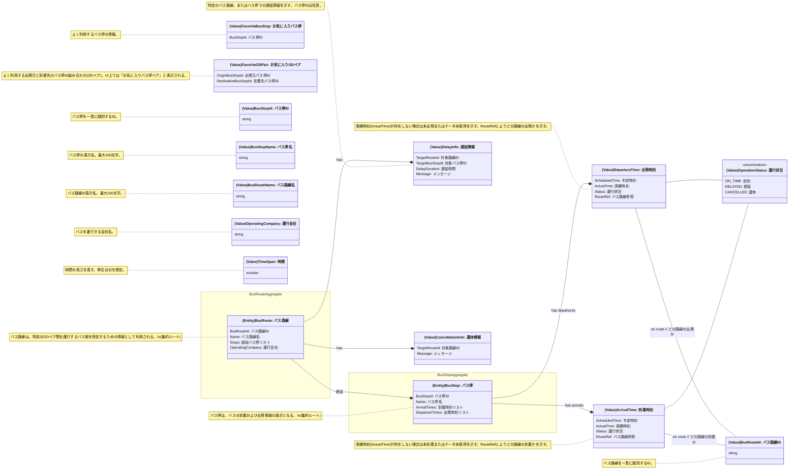

# ドメインモデル図

## ユビキタス言語

- **バス停 (BusStop)**: バスの停留所。
- **バス路線 (BusRoute)**: バスが運行する経路。（特定のODペア間の移動手段を見つけるための足がかりとして利用される）
- **ODペア (OriginDestinationPair)**: 「出発元バス停」と「到着先バス停」の組み合わせ。UI上では「バス停ペア」と表現される。
- **到着時刻 (ArrivalTime)**: バスがバス停に到着する予定時刻または実績時刻。
- **出発時刻 (DepartureTime)**: バスがバス停を出発する予定時刻または実績時刻。
- **遅延情報 (DelayInfo)**: バスの遅延に関する情報。
- **運休情報 (CancellationInfo)**: バスの運休に関する情報。
- **運行状況 (OperationStatus)**: バスの現在の運行状態（定刻、遅延、運休など）。
- **お気に入りバス停 (FavoriteBusStop)**: よく利用する単体のバス停を登録する機能。
- **お気に入りODペア (FavoriteODPair)**: よく利用するODペアを登録する機能。UI上では「お気に入りバス停ペア」と表現される。

## ドメインモデル図

## ドメイン要素の説明

### 集約 (Aggregate)

- **`BusStop` 集約 (BusStop Aggregate)**
    - **集約ルート**: `BusStop` (バス停エンティティ)
    - **含まれるエンティティ**: (なし)
    - **含まれる値オブジェクト**: `BusStopId`, `BusStopName`, `ArrivalTime` (リスト), `DepartureTime` (リスト), `OperationStatus` (ArrivalTime/DepartureTime経由で関連)
    - **不変条件の例**: 
        - バス停IDは不変。
        - 到着/出発時刻は、そのバス停に実際に紐づくものでなければならない。
    - **説明**: 特定のバス停に関する全ての情報を管理する単位。バス停の基本情報、関連する全ての到着・出発時刻情報、およびそれらの運行状況の整合性を保ちます。

- **`BusRoute` 集約 (BusRoute Aggregate)**
    - **集約ルート**: `BusRoute` (バス路線エンティティ)
    - **含まれるエンティティ**: (なし ※経由バス停(`Stops`)は`BusStop`集約への参照)
    - **含まれる値オブジェクト**: `BusRouteId`, `BusRouteName`, `OperatingCompany`, `DelayInfo` (リスト), `CancellationInfo` (リスト)
    - **不変条件の例**: 
        - バス路線IDは不変。
        - 路線に紐づく遅延・運休情報は、その路線に関するものでなければならない。
    - **説明**: 特定のバス路線に関する情報（基本情報、運行会社、関連する全ての遅延・運休情報）を管理する単位。経由するバス停の情報は、`BusStop`集約への参照として保持します。

- **お気に入り (Favorites)**
    - このドキュメントでは、お気に入りの `FavoriteBusStop` と `FavoriteODPair` は値オブジェクトとして定義されています。これらは特定の集約ルートの配下には属さず、システムがこれらのリストを管理するイメージです。もし「お気に入りリスト」自体にIDが付与され、ライフサイクルを持つような場合は、別途「お気に入りリスト集約」のようなものを定義する必要がありますが、現状の小規模システムでは、これらを値オブジェクトの集合として扱います。

### エンティティ (Entity)

- **BusStop (バス停)**: バスの停留所。一意な `バス停ID` (`BusStopId`) で識別され、`バス停名` (`Name`) を持ちます。関連する `到着時刻` (`ArrivalTime`) のリストと `出発時刻` (`DepartureTime`) のリストを保持します。
- **BusRoute (バス路線)**: バスが運行する経路。一意な `バス路線ID` (`BusRouteId`) で識別され、`バス路線名` (`Name`)、`経由バス停リスト` (`Stops`)、`運行会社` (`OperatingCompany`) 情報を持ちます。関連する `遅延情報` (`DelayInfo`) や `運休情報` (`CancellationInfo`) を保持します。

### 値オブジェクト (Value Object)

- **ArrivalTime (到着時刻)**: バスがバス停に到着する `予定時刻` (`ScheduledTime`) と `実績時刻` (`ActualTime`)、その時点での `運行状況` (`Status`)、およびどの `バス路線参照` (`RouteRef`) の到着かを示します。
- **DepartureTime (出発時刻)**: バスがバス停を出発する `予定時刻` (`ScheduledTime`) と `実績時刻` (`ActualTime`)、その時点での `運行状況` (`Status`)、およびどの `バス路線参照` (`RouteRef`) の出発かを示します。
- **DelayInfo (遅延情報)**: 特定のバス路線の `対象路線ID` (`TargetRouteId`) やバス停の `対象バス停ID` (`TargetBusStopId`、任意)における `遅延時間` (`DelayDuration`) や `メッセージ` (`Message`) を保持します。
- **CancellationInfo (運休情報)**: 特定のバス路線の `対象路線ID` (`TargetRouteId`) の運休に関する `メッセージ` (`Message`) を保持します。
- **OperationStatus (運行状況)**: バスの運行が「定刻(ON_TIME)」、「遅延(DELAYED)」、「運休(CANCELLED)」のいずれかであるかを示す列挙型。
- **FavoriteBusStop (お気に入りバス停)**: お気に入りに登録したバス停の `バス停ID` (`BusStopId`) を保持します。
- **FavoriteODPair (お気に入りODペア)**: お気に入りに登録した「出発元バス停ID」(`OriginBusStopId`)と「到着先バス停ID」(`DestinationBusStopId`)の組み合わせを保持します。UI上では「お気に入りバス停ペア」と表現されます。
- **BusStopId (バス停ID)**: バス停を一意に識別するID。型は `string`。
- **BusStopName (バス停名)**: バス停の名称。型は `string`。
- **BusRouteId (バス路線ID)**: バス路線を一意に識別するID。型は `string`。(ArrivalTimeやDepartureTime内のRouteRefとしても利用)
- **BusRouteName (バス路線名)**: バス路線の名称。型は `string`。
- **OperatingCompany (運行会社)**: バスを運行する会社の名前。型は `string`。
- **TimeSpan (時間)**: 時間の長さを表す数値。型は `number` で、単位は分を想定。 