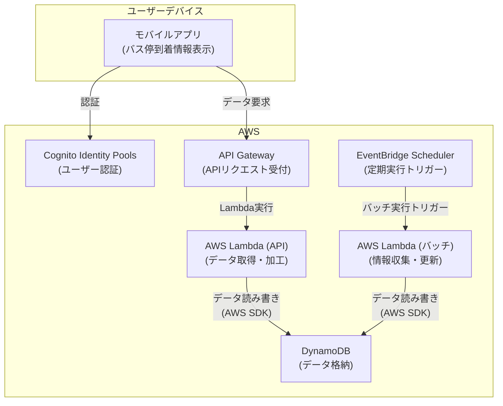
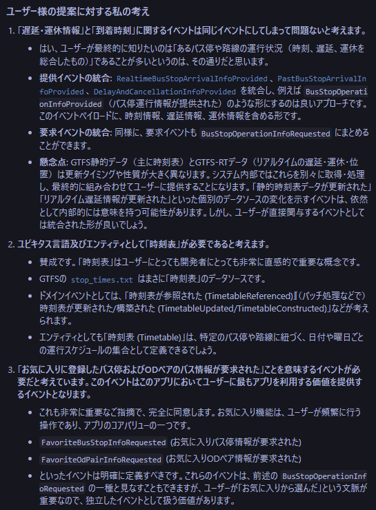

# Prompt
## 目的
システム概要の作成

## 指示内容
docs/02_システム構成図.mdを作成し、01_システム概要.mdの内容を参考にシステム構成図を作成してください。

# Response

# システム構成図

```mermaid
graph TD
    subgraph "ユーザーデバイス"
        A[モバイルアプリ (Ionic/Angular/Capacitor)]
    end

    subgraph "AWS"
        B[Cognito Identity Pools]
        C[API Gateway]
        D[AWS Lambda (API)]
        E[AWS Lambda (バッチ処理)]
        F[DynamoDB]
        G[EventBridge (Scheduler)]
    end

    subgraph "開発・CI/CD"
        H[GitHub]
        I[GitHub Actions]
        J[AWS SAM]
    end

    A -- 認証 --> B
    A -- APIリクエスト --> C
    C -- 実行 --> D
    D -- データアクセス --> F
    G -- トリガー --> E
    E -- データアクセス --> F
    H -- CI/CDトリガー --> I
    I -- デプロイ --> J
    J -- デプロイ --> D
    J -- デプロイ --> E
```

## コンポーネント概要

- **モバイルアプリ (Ionic/Angular/Capacitor)**: ユーザーインターフェースを提供。バス停到着情報を表示。
- **Cognito Identity Pools**: ユーザー認証とAWSリソースへのアクセス権限管理。
- **API Gateway**: モバイルアプリからのリクエストを受け付け、バックエンドLambdaへルーティング。
- **AWS Lambda (API)**: ビジネスロジックを実行し、DynamoDBと連携してデータを提供。
- **AWS Lambda (バッチ処理)**: 定期的にバス情報などを取得・更新。
- **DynamoDB**: アプリケーションデータを格納するNoSQLデータベース。
- **EventBridge (Scheduler)**: バッチ処理Lambdaを定期実行するためのスケジューラ。
- **GitHub**: ソースコード管理。
- **GitHub Actions**: CI/CDパイプラインを実行。テスト、ビルド、デプロイを自動化。
- **AWS SAM**: サーバーレスアプリケーションの定義とデプロイを管理。

```
```

# Prompt
## 指示内容
デプロイ方法、開発環境、テスト方法に関しての記述は必要ないので削除してください。
AWS SAMはLambdaからDynamoDBにアクセスする手段に使われることを示してください。
図上でもシステムを知らない人向けにそれが何をもたらすかを簡潔に記述してください。

# Response
# システム構成図



## コンポーネント概要

- **モバイルアプリ**: ユーザーがバス停到着情報を閲覧するためのインターフェース。
- **Cognito Identity Pools**: ユーザー認証を行い、安全なアクセスを実現。
- **API Gateway**: モバイルアプリからのリクエストを受け付け、適切なLambda関数へ転送。
- **AWS Lambda (API)**: ユーザーリクエストに基づき、DynamoDBからデータを取得・加工して応答。
- **AWS Lambda (バッチ)**: 定期的に外部（例：バス会社のAPIなど）から情報を取得し、DynamoDBを更新。
- **DynamoDB**: バスの到着情報やユーザー設定などのデータを格納するデータベース。
- **EventBridge Scheduler**: バッチ処理用のLambda関数をスケジュール通りに起動。


# Prompt 
## 目的
ユースケース図を作成してください。

## 指示内容
1. docs/03_ユースケース図.mdを作成してください。
2. 補足内容と01_システム概要.mdの内容を参考にユースケース図を作成してください。

出力結果を# responseに記述してください。
# Response

# ユースケース図

```mermaid
graph TD
    subgraph システム境界
        UC1["バス停到着情報を表示する"]
        UC2["ユーザー認証を行う"]
        UC3["バス情報を自動更新する"]
    end

    actor ユーザー
    actor Admin [システム管理者]

    ユーザー -- UC1
    ユーザー -- UC2
    Admin -- UC3
```

## ユースケース概要

- **バス停到着情報を表示する**: ユーザーがモバイルアプリ上で指定したバス停の到着予定時刻などを確認する。
- **ユーザー認証を行う**: ユーザーがシステムを利用するためにログイン・認証を行う。
- **バス情報を自動更新する**: システムが定期的に外部からバス情報を取得し、データベースを最新の状態に保つ。 (主にバッチ処理が担当)

*※ `01_システム概要.md` に詳細なユースケースが記述されていれば、より正確な図を作成できます。*
# Prompt

## 指示内容
01_システム概要.mdの内容を参考にdocs/03_ユーザーストーリー図.mdを作成してください。
たたき台程度で問題ないです。

# Response
はい、承知いたしました。
docs/01_システム概要.md を参考に、docs/03_ユーザーストーリー図.md のたたき台を作成します。
# ユーザーストーリー図

## エピック: バス時刻情報管理

### 機能: バス停の到着情報を閲覧する

#### ストーリー 1: 現在の到着情報を確認したい
- **役割**: 利用者
- **機能**: 特定のバス停の現在の到着予定時刻と遅延情報を確認したい
- **価値**: バスがいつ来るかを知り、待ち時間を有効活用したり、移動計画を調整したりできるようにするため

#### ストーリー 2: 過去の到着情報を確認したい
- **役割**: 利用者
- **機能**: 特定のバス停の過去の到着時刻履歴を確認したい
- **価値**: 過去の運行パターン（遅延の傾向など）を把握し、将来の移動計画の参考にできるようにするため 

docs/03_ユーザーストーリー図.md にユーザーストーリー図のたたき台を作成しました。
ご確認いただき、必要に応じて修正してください。

# Prompt

## 指示内容
docs/03_ユーザーストーリー図.mdの内容を記述してください。
その際、以下の内容の意味を大きく変えずによりユーザーストーリーとして適した形で記述してください。
他のユーザーストーリーがあればそれも記述してください。

- ユーザーはバス到着時刻を確認したい。なぜなら移動時間を調整したいからだ。
- ユーザーは過去のバス到着時刻を確認したい。なぜならバスの遅れの傾向を把握したいからだ。
- ユーザーはお気に入りのバス停を登録したい。なぜならよく行くバス停の情報はすぐに確認したいからだ。


# Prompt
ありがとうございます。
下記内容を新たに追加し、価値を適切に記述してください。

- ユーザーはお気に入りのバス路線を登録したい。
- ユーザーはバスの遅延や運休情報を確認したい。
- ユーザーはバス停やバス路線を検索したい。

# Prompt 
オブジェクト図の作成に入ります。
01_システム概要.mdの内容及び、03_ユーザーストーリー図.mdの内容を参考にdocs/04_オブジェクト図.mdを作成してください。
Mermaidで記述してください。
UMLで日本語を使用する場合はダブルクォーテーションで囲んでください。

# Prompt
## 目的
ドメインモデル図の作成
ユビキタス言語の定義、ドメイン要素(集約、値オブジェクト、エンティティ)の特定

## 指示内容
1. DDDとドメインモデル図についてwebで調べてください。
2. 01_システム概要.mdの内容及び、03_ユーザーストーリー図.mdの内容を参考にdocs/05_ドメインモデル図.mdを作成してください。
3. ドメインモデル図をMermaidで作成してください。
4. 内容を確認し、資料や要件との矛盾点や誤解を生みそうな部分があれば修正してください。

# Prompt
## 目的
ドメインモデル図の作成
ユビキタス言語の定義、ドメイン要素(集約、値オブジェクト、エンティティ)の特定

## 指示内容
1. DDDとドメインモデル図についてwebで調べてください。
2. 01_システム概要.mdの内容及び、03_ユーザーストーリー図.mdの内容を参考にdocs/05_ドメインモデル図.mdを作成してください。
3. 「ユビキタス言語」セクションと「ドメインモデル図」セクションを作成してください。ドメインモデル図セクションはMermaidのClass図で作成してください。
4. 内容を確認し、資料や要件との矛盾点や誤解を生みそうな部分があれば修正してください。

## 補足内容
小規模なプロジェクトであることを意識してください。

# Prompt

## 指示内容
補足情報を参考に03_ユーザーストーリー図.mdと05_ドメインモデル図.mdを修正してください。

## 補足情報
ユーザーが最も興味があるのは「指定のバス停（出発元）」から「指定のバス停（到着先）」まで運行を行うバスの「出発元バス停への到着時刻」と「到着先バス停の到着時刻」です。そしてそれらを予測できる情報を得たいと考えています。
このアプリにとって、バス路線はあくまでその情報を取得するための足がかりとしての意味しか持ちません。

# Prompt
## 指示内容
下記内容の通りに03_ユーザーストーリー図.mdと05_ドメインモデル図.mdを修正してください。

- 新たにユビキタス言語としてバス区間（仮名称）を定義してください。
- ユーザーはバス路線ではなくバス区間に興味があります。
- それを踏まえてお気に入りバス路線をお気に入りバス区間に置き換えてください。
- その他変更するべき点があればそれも変更してください。
- バス区間という名称に関してはより良い名称が無いか熟考し、その名称を定義してください。

## 補足情報
バス区間とは、出発元バス停から到着先バス停の組み合わせを指します。どのバス路線を通るか(つまりどういった運行ルートを通るか)は考慮しません。

# Prompt 

## 指示内容
「純粋に二つのバス停の組み合わせであることを示す名称」としてバス停ペア以外の名称の案も列挙してください。
できれば出発元バス停と到着先バス停の組み合わせであることが理解できる名称が望ましいです。

# Prompt
画面上での考慮を失念しておりました。
画面上で表示されるのはお気に入り画面を想定しており、「お気に入り」「出発元バス停」「到着先バス停」という文脈があるならば「バス停ペア」という名称が最も理解しやすいと感じます。
ですがドメインモデル作成においてはODペアが最も理解しやすく簡潔であるように思います。

ユビキタス言語での名称と画面上の名称に相違がある場合の事例をWebで調査し、総合的に評価を行ってください。

# Prompt 
## 指示内容
05_ドメインモデル図.mdを下記内容に従って修正してください。
- バス停ペアをODペアに置き換えてください。
- ODペアはUI上では「バス停ペア」と表現されることを明確にしてください。

# Prompt
## 指示内容
05_ドメインモデル図.mdを下記内容に従って修正してください。
- 利用者はドメイン上（及びシステム上）では表現されず、また区別もされません。そのため、利用者に関する記述を削除してください。
- 利用者お気に入りなどは、ただのお気に入りとして表現してください。

# Prompt
## 指示内容
1. WebでDDDにおける集約、エンティティ、値オブジェクトについて調べてください。
2. 05_ドメインモデル図.mdを確認し、エンティティと値オブジェクトを適切に再定義してください。
3. 定義したエンティティと値オブジェクトの関連性が適切かどうかを検討してください。
4. 集約と集約ルートを定義してください。
5. 1~4の内容を踏まえて05_ドメインモデル図.mdを修正してください。
6. 05_ドメインモデル図.mdを再確認してください。

# Prompt
Mermaidによるドメインモデル図で集約と集約ルートを表現してください。
配置などの見た目部分は後ほど別途修正を行うので、今は考慮する必要はありません。

# Prompt
## 指示内容
1. 01_GTFS-JPデータ仕様書.mdと02_GTFS-RTデータ仕様書.mdを読み取ってください。GTFS-JP及びGTFS-RTはこのアプリのメインのデータソースとなります。
2. GTFS仕様書を参考に、
**close**

# Prompt

## 目的
AIと協力してイベントストーミング行うために、modeling-rules.mdcに記述を追加したい。

## 指示内容
1. イベントストーミングについてWebで調べてください。
2. 調べた内容を要約してください。
3. modeling-rules.mdcに記述を追加してください。

## 要望
- `# 作成フロー`セクション、`# 要素`セクション `要点`セクションを追加してください。
- 作成フローセクションにはイベントストーミングの進め方を手順ごとに簡単に記述してください。
- 要素セクションにはイベントストーミングにおける各要素(ドメインイベント、コマンドなど)を記述してください。
- 要点セクションにはその他懸念事項などを記述してください。

# Prompt

## 指示内容
- 小規模な個人開発なのでチームに関する記述を修正もしくは削除してください。
- 成果物はマークダウン上のMermaidのClassDiagramを利用するため、付箋は利用しません。
    - 色は`Style`キーワードで表現することができます。
- 箇条書きには`*`ではなく`-`を利用してください。

# Prompt
## 目的
- イベントストーミングの開始
- ドメインイベントの洗い出し

## 指示内容
- docsフォルダの中身ファイルをすべて読みこんでください。
    - GTFS仕様書の中身もすべて読みこんでください。
- ドメインイベントと思われるものをMermaidのClassDiagramとして04_イベントストーミングマップ.mdに記述してください。
- 判断に悩む部分があれば、私に相談してください。

## 補足内容
- 05_ドメインモデル図.mdは仮のものであることを留意してください
- docs/GTFS仕様書フォルダの中身は当アプリのメインのデータソースの資料のため、これらをそのまま読み込むのは開発者目線に寄りすぎます。
    - これらファイルの情報は「ドメインエキスパートから提供された情報」であると考えてください。

# Prompt

# 回答
1. 現行で問題ないです。
2. 現行で問題ないです。
3. 「表示されたイベント」は必要ないと考えています。現行で問題ないです。

# 目的
- スタイルクラスの定義
- 属性の削除
- ドメインイベントの整理

# 指示内容
- `https://mermaid.js.org/syntax/classDiagram.html#classes`を参考にスタイルクラスを定義してください。
- 属性に関する記述は現状では不要だと考えています。すべて削除してください。
- 要求と提供の使い分けの意図を教えて下さい。
- 以下のことについてあなたの考えを教えて下さい。
    - 「遅延・運休情報」と「到着時刻」に関するイベントは同じイベントにしてしまって問題ないと考えます。
    - ユビキタス言語及びエンティティとして「時刻表」が必要であると考えます。
    - 「お気に入りに登録したバス停およびODペアのバス情報が要求された」ことを意味するイベントが必要だと考えています。このイベントはこのアプリにおいてユーザーに最もアプリを利用する価値を提供するイベントとなります。



# Prompt 
## 目的
- イベントストーミングマップの作成

## 指示内容
- modeling-rules.mdcの作成フローに従って`7. 外部システムの識別`まで04_イベントストーミングマップ.mdの記述を行ってください。
- 判断に悩む部分があれば、私に相談してください。
- ホットスポットの追加はいつでも実行して貰って構いません。

## フローごとの手順
1. フローを確認します。
2. フローに従ってイベントストーミングマップの要素の追加や記述を行います。
3. 作成したものを確認し、要件に沿ったものとなっているかの自己レビューを行います。
4. 修正箇所がある場合は手順2に戻り、修正を行います。(分からない部分があればユーザーに相談するために分からない部分を記憶します)
5. 要件を満たしたものとなった場合、次のフローに進みます。

# Prompt
## 指示内容
- 図が横長になりすぎないよう配置を調整してください。縦長になるのは問題ないです。
- 集約を一つのアイテムで表現しているため読みづらくなっています。ドメインイベント:集約を1:1の関係で表現してください。
    - これにあたって、全く同じ集約のアイテムが複数存在するようになりますが、問題ありません。

# Prompt
## 回答
1. 集約のように切り分けてほしいです。
2. 特にございません。
3. 仰る通りです。userからの実行を表すよう関連の追加をお願いいたします。

## 目的
- 図の見た目調整

## 指示内容
- 1ノードにつき1アクターの関係にするなど各要素をノードにごとに切り分けてください。

## 補足
> あるドメインイベントが別のドメインイベントを発生させる場合、以下のように各要素を経由してドメインイベント同士の関係性を表現しなければいけないというルールがあります。
ドメインイベント -> ビュー/リードモデル -> アクター -> コマンド -> 外部システム/集約 -> ドメインイベント
ドメインイベント -> ポリシー -> コマンド -> 外部システム/集約 -> ドメインイベント

# Prompt
## 回答
1. 改善されていません。
2. 適切のように見えますが、図から判断をすることが困難です。
3. 意図通りです。

# 指示内容
- 各ノードにつき1アクターの関係にするなど各要素をノードにごとに切り分けてください。
- 1つのアイテムから出る参照関係は最大1つとしてください。

# Prompt
- 先程の指示内容である
```
- 各ノードにつき1アクターの関係にするなど各要素をノードにごとに切り分けてください。
- 1つのアイテムから出る参照関係は最大1つとしてください。
```
がどちらも守られていません。
- 先程の指示内容をよく理解してください。
- 分からなければ分からないと言ってください。
- 集約が各ノードに対し一つの参照となったのに対し、アクターはそうではありません。

# Prompt 
## 目的
図の

## 指示内容
全てのノードでルール違反が起きています。再度確認してください。
例としてBusStopOperationInfoノードでは以下のようなルール違反が起きています
- RequestBusStopOperationInfoは2つ以上の要素をターゲット指定している
- RequestBusStopOperationInfoのターゲット指定が集約もしくは外部システムでない
- BusStopOperationInfoScreenは2つ以上の要素からターゲット指定されている
- BusStopOperationInfoRequestedのターゲット指定がポリシーもしくはビューもしくはリードモデルでない箇所がある
- BusStopOperationInfoProvidedのターゲット指定がポリシーもしくはビューもしくはリードモデルでない箇所がある

## 補足
以下のことを意識してください。
- ノード外への参照はドメインイベントを経由して行われなければならない
- 要素の入れ替えに関しては基本ノード内で入れ替えを行うのみでokです
- 基本的にドメインイベント以外でファイル内に3つ以上同じクラス名が記述されることはないです

# Prompt

## 指示内容
確認を行いましたが、改善されていない部分があります。アプローチを変えます。

1. ファイル内のすべての参照関係を削除してください。
2. ノード内の要素を5つ以下となるようノードの分割と要素の複製を行ってください。
3. ノード内の要素が`「ビュー/リードモデル/ポリシー」「アクター」「コマンド」「外部システム/集約」「ドメインイベント」`となっていることを確認してください。なお、ポリシーが要素内に存在する場合はアクターは不要です。
4. ターゲット指定のルールを元に関係性の定義を行ってください。
5. modeling-rules.mdcの#### 確認事項を読み取り、確認を行ってください。

## 指示内容
要素の複製という文脈が消えています。

1. ファイル内のすべての参照関係を削除してください。
2. ノード内の要素として足りない要素を定義してください。
    - 例えば、`「ビュー」「コマンド」「集約」「ドメインイベント」`であれば`アクター`が足りないので定義してください。
3. ノード内の要素が`「ビュー/リードモデル/ポリシー」「アクター」「コマンド」「外部システム/集約」「ドメインイベント」`となっていることを確認してください。なお、ポリシーが要素内に存在する場合はアクターは不要です。
4. ターゲット指定のルールを元に関係性の定義を行ってください。
5. modeling-rules.mdcの#### 確認事項を読み取り、確認を行ってください。

## 指示内容
ファイル内のすべての参照関係を削除してください。

## 指示内容
すべてのidを`<名称の英語訳>_<ノード名称>`としてください。名称は日本語のまま保持してください。

## 指示内容
04_イベントストーミングマップ.mdを修正してください。

1. modeling-rules.mdcのイベントストーミングセクションを確認してください。
2. ノード内の要素として足りない要素を定義してください。
    - 例えば、`「ビュー」「コマンド」「集約」「ドメインイベント」`であれば`アクター`が足りないので定義してください。
3. ノード内の要素が`「ビュー/リードモデル/ポリシー」「アクター」「コマンド」「外部システム/集約」「ドメインイベント」`となっていることを確認してください。なお、ポリシーが要素内に存在する場合はアクターは不要です。
4. ターゲット指定のルールを元に関係性の定義を行ってください。
5. modeling-rules.mdcの#### 確認事項を読み取り、確認を行ってください。

## 指示内容
- ODペア検索画面とバス停運行情報確認画面は同一の画面としてください。
- この後、運行情報確認画面のドメインの洗い出しを行います。そのために画面ごとに境界づけられたコンテキストを作成してください。

## 補足
当アプリの画面は以下2つです
- 運行状況確認画面(メイン画面)
- お気に入り画面

それ以外のViewについてはコンポーネントとして扱います。
別の境界づけられたコンテキストと関係を持つ場合は密結合になりすぎないように注意してください。

## 指示内容
図をシンプルなものとしたいです。
そのために以下の変更を行ってください。modeling-rulesとプロンプトで指示の相違がある場合はプロンプトを優先してください。
- 1ノードを1classとして扱います。
    - クラス名: ノード名
    - 属性: `要素 名称`
    - 要素名は現在の`名称_ノード名`から`名称`に変更してください。
    - 補足セクションの例を参考にしてください。
- 境界づけられたコンテキストをnamespaceで表現してください。
    - 境界づけられたコンテキストは「運行情報表示」と「お気に入り」と「DB更新」の3つです。
        - それぞれは仮の名称です。適切に命名してください。

## 補足
- class記述例
```mermaid
class GtfsDataUpdateContext{
    Actor System
    Command UpdateGtfsRealtimeData
    Aggregate GtfsData
    DomainEvent GtfsRealtimeDataUpdated
}
```
# Prompt
## 目的
- 関連性の記述(図上の関連性の復元)

## 指示内容
- 関連を適切に記述してください。
    - 境界づけられたコンテキスト内で関連を記述したあと、境界づけられたコンテキストを跨ぐ関連を記述してください。
- classの属性を日本語に書き換えてください。

# Prompt
# 目的
関連性の記述(図上の関連性の復元)

# 指示内容
- Context Internal Relationships内の内容とContext Spanning Relationships内の内容を削除してください。
- 現在大幅なルール改定中です。modeling-rules.mdcの記述に従うか迷った場合はプロンプトを優先してください。
- namespaceのクラス内で関連性を記述してください。

# 補足
以下の操作は必要ありませんでした。
イベントストーミングマップを作成する重要な意味の一つとして関係性の図示があります。忘れないようにしてください。
```
図をシンプルにするため、既存の詳細な要素間の関係定義（矢印）はすべて削除します。各コンテキスト内の処理の流れは、クラス内の属性の順序や、必要に応じて後でコンテキスト間の大まかな連携を示すことで表現することを想定します。
```